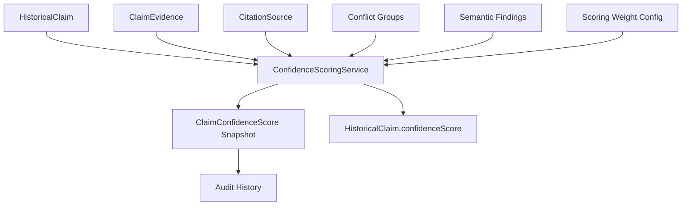
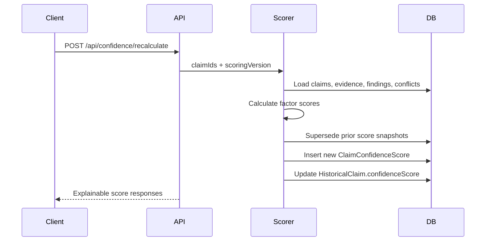

# Confidence Scoring Engine

## Purpose

The Confidence Scoring Engine assigns explainable trust scores to historical claims using configurable weighted factors.

## Architecture



## Factors

The default model scores each factor from `0.0` to `1.0`:

- `institutionReputation`
- `citationQuality`
- `researcherReputation`
- `consensusSimilarity`
- `sourceReliability`
- `moderatorApproval`
- `historicalConsistency`
- `evidenceQuality`

## Default Weights

```json
{
  "institutionReputation": 0.12,
  "citationQuality": 0.14,
  "researcherReputation": 0.10,
  "consensusSimilarity": 0.14,
  "sourceReliability": 0.16,
  "moderatorApproval": 0.12,
  "historicalConsistency": 0.12,
  "evidenceQuality": 0.10
}
```

## Formula

```text
claim_confidence =
  sum(factor_score * factor_weight) / sum(factor_weight)
```

Labels:

```text
0.85 - 1.00 -> HIGH
0.65 - 0.84 -> MEDIUM
0.40 - 0.64 -> LOW
0.00 - 0.39 -> VERY_LOW
```

## Example Calculation

```text
institutionReputation = 0.90
citationQuality       = 0.82
researcherReputation  = 0.82
consensusSimilarity   = 0.75
sourceReliability     = 0.88
moderatorApproval     = 0.88
historicalConsistency = 0.85
evidenceQuality       = 0.70
```

Weighted score:

```text
(0.90*0.12) +
(0.82*0.14) +
(0.82*0.10) +
(0.75*0.14) +
(0.88*0.16) +
(0.88*0.12) +
(0.85*0.12) +
(0.70*0.10)
= 0.824
```

Result:

```text
score = 0.824
label = MEDIUM
```

## Persistence

Tables:

- `scoring_weight_configs`: versioned weight definitions.
- `claim_confidence_scores`: immutable score snapshots and explanations.

The latest score is the row where:

```text
claim_id = ?
superseded = false
```

Older rows remain available for audit.

## APIs

```text
POST /api/confidence/score
POST /api/confidence/recalculate
GET  /api/confidence/claim/{claimId}
GET  /api/confidence/claim/{claimId}/history
POST /api/confidence/weights
GET  /api/confidence/weights/active
```

## Recalculation Workflow



## Explainability

Each score stores:

- final score
- confidence label
- scoring version
- individual factor scores
- human-readable explanation per factor
- timestamp
- calculated-by user ID

## Event-Driven Suggestions

Future async recalculation can subscribe to:

- `HistoricalClaimCreated`
- `HistoricalClaimUpdated`
- `ClaimEvidenceAdded`
- `CitationSourceReliabilityChanged`
- `ConflictGroupResolved`
- `SemanticValidationCompleted`
- `ClaimModerated`

Each event can enqueue:

```text
RecalculateClaimConfidence(claimId)
```

This keeps confidence scores fresh without forcing synchronous recalculation during every write.
