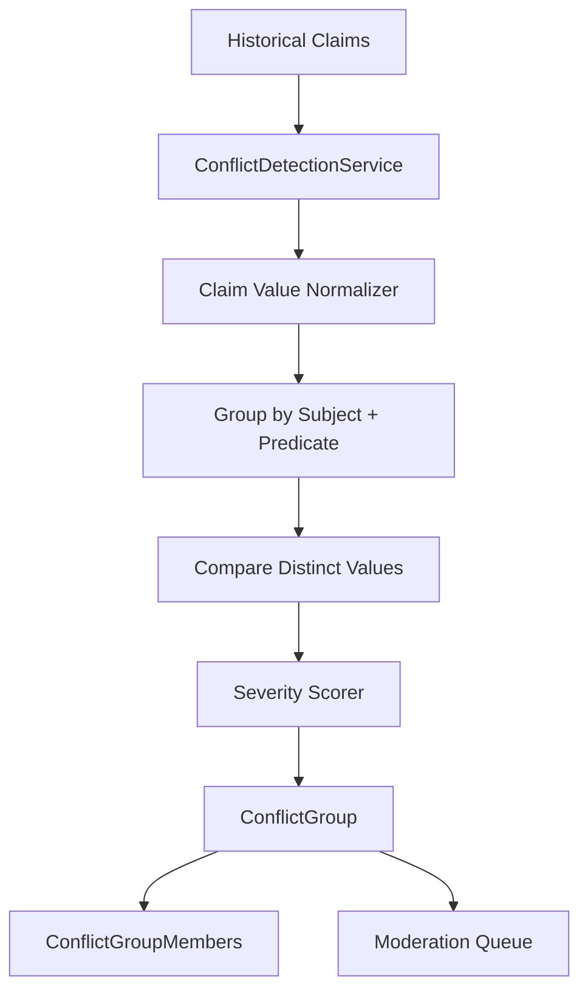
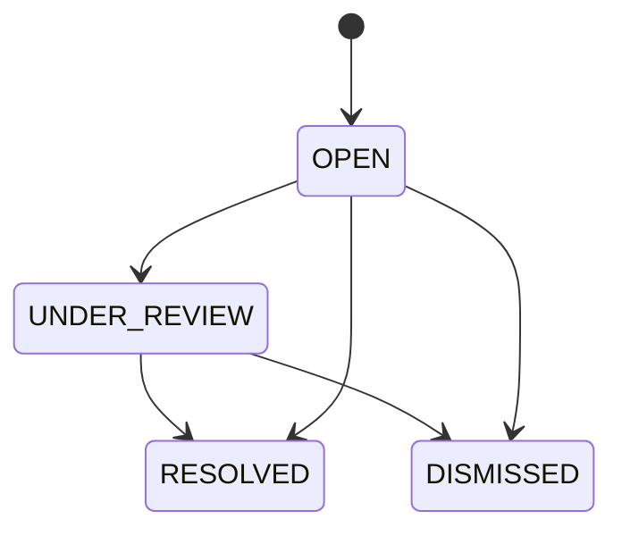
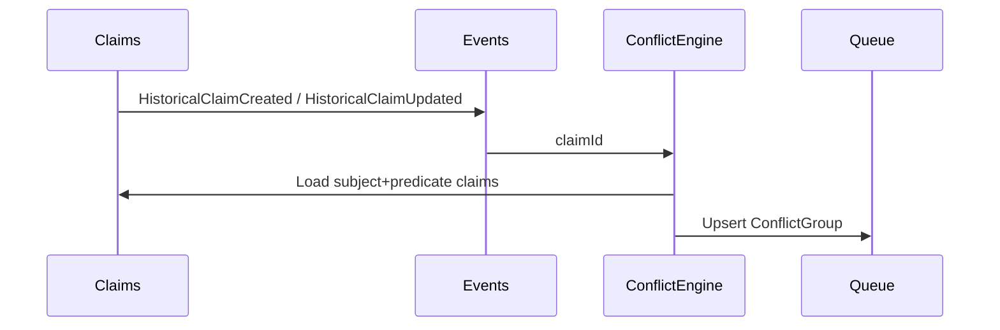

# Conflict Detection Engine

## Purpose

The Conflict Detection Engine finds incompatible historical claims for the same subject and predicate.

Example:

```text
Mauryan Empire START_YEAR = 321 BCE
Mauryan Empire START_YEAR = 322 BCE
```

These claims are grouped into one moderation item because they describe the same field on the same entity with distinct normalized values.

## Architecture



## Database Schema

Tables:

- `conflict_groups`: one reviewable group per detected subject/predicate/type conflict.
- `conflict_group_members`: historical claim IDs participating in a conflict group.

Important fields:

- `subject_entity_id`
- `predicate`
- `conflict_type`
- `severity`
- `severity_score`
- `confidence_score`
- `conflicting_values`
- `status`
- `resolved_claim_id`

## Conflict Algorithms

Claims are first grouped by:

```text
subject_entity_id + predicate
```

Each claim is normalized according to inferred conflict type:

- `DATE`: extracts year/date/start/end values, supports BCE/BC conversion.
- `RULER`: extracts ruler/person/entity references.
- `LOCATION`: extracts location/place/capital references.
- `RELATIONSHIP`: extracts object entity or relationship target.
- `EVENT`: extracts event IDs, names, or descriptions.
- `FACT`: generic fallback.

If a group contains two or more distinct normalized values, a conflict is emitted.

## Severity Scoring

Date severity depends on spread:

```text
1 year       -> WARNING, 0.42
2-10 years  -> WARNING, 0.58
11-100 years -> ERROR, 0.82
100+ years  -> CRITICAL, 0.95
```

Other defaults:

```text
RULER        -> ERROR, 0.82
LOCATION     -> ERROR, 0.78
RELATIONSHIP -> ERROR, 0.84
EVENT        -> WARNING, 0.68
FACT         -> WARNING, 0.60
```

## APIs

```text
POST  /api/conflicts/detect
POST  /api/conflicts/detect/claim/{claimId}
GET   /api/conflicts/queue
GET   /api/conflicts/subject/{subjectEntityId}
PATCH /api/conflicts/{conflictGroupId}/moderate
```

## Moderation Workflow



Moderators can:

- mark a group under review
- choose a resolved canonical claim
- dismiss a false positive
- attach review notes

## Indexing Strategy

Primary lookup indexes:

```sql
conflict_groups(subject_entity_id, predicate)
conflict_groups(status, severity_score DESC)
conflict_groups(conflict_type)
conflict_group_members(conflict_group_id)
conflict_group_members(claim_id)
```

The open-group uniqueness index prevents duplicate active queue entries:

```sql
subject_entity_id + predicate + conflict_type
WHERE status IN ('OPEN', 'UNDER_REVIEW')
```

Recommended additional claim-side index:

```sql
historical_claims(subject_entity_id, predicate)
```

This already exists in the historical claims migration.

## Event-Driven Suggestions

Recommended event flow:



Suggested events:

- `HistoricalClaimCreated`
- `HistoricalClaimUpdated`
- `HistoricalClaimModerated`
- `ConflictGroupCreated`
- `ConflictGroupResolved`

For now, NexusA exposes synchronous APIs. The service is shaped so it can later be called from a message listener or Spring application event handler without changing the comparison logic.
