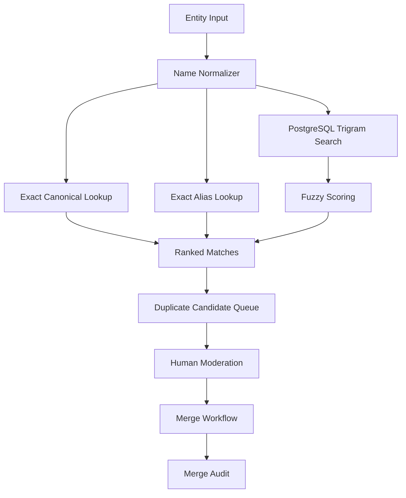

# Entity Resolution and Canonicalization

## Purpose

The Entity Resolution module prevents duplicate civilizations and historical entities by mapping names such as `Ancient Egypt`, `Kemet`, and `Egyptian Kingdom` to a single canonical entity.

## Architecture



## Core Tables

- `canonical_entities`: one durable canonical ID per historical entity.
- `entity_aliases`: aliases, transliterations, historical names, and former names.
- `duplicate_entity_candidates`: review queue for likely duplicates.
- `entity_merge_audits`: immutable audit trail for merge actions.

PostgreSQL `pg_trgm` powers fuzzy indexed lookup on `normalized_name` and `normalized_alias`.

## Matching Algorithm

Resolution uses layered evidence:

- normalized exact canonical-name match
- normalized exact alias match
- trigram candidate search
- token Jaccard similarity
- Levenshtein edit similarity
- temporal overlap
- entity-type agreement

Weighted score:

```text
0.42 name similarity
0.20 token overlap
0.14 edit similarity
0.14 temporal overlap
0.10 type agreement
```

Exact alias matches are promoted to at least `0.94`.

## APIs

```text
POST  /api/entity-resolution/canonical
GET   /api/entity-resolution/canonical/{canonicalId}
POST  /api/entity-resolution/canonical/{canonicalId}/aliases
POST  /api/entity-resolution/resolve
POST  /api/entity-resolution/duplicates/detect
GET   /api/entity-resolution/duplicates
PATCH /api/entity-resolution/duplicates/{candidateId}/moderate
POST  /api/entity-resolution/merge
```

## Duplicate Detection Strategy

For one canonical entity, compare it against active entities of the same type.

For batch scans, compare active entities pairwise and persist candidates above the request threshold.

Candidate evidence includes:

- score components
- alias match flag
- strategy used
- explanation text

## Merge Workflow

1. Moderator approves or directly requests a merge.
2. Source and target canonical entities are loaded.
3. Source aliases are copied to the target unless already present.
4. Source canonical name becomes a target `FORMER_NAME` alias.
5. Source entity is marked `MERGED`.
6. Source receives `mergedIntoId`.
7. An immutable `entity_merge_audits` row stores before snapshots and reason.
8. Matching duplicate candidates are marked `MERGED`.

## Moderation Workflow

Duplicate candidates move through:

```text
PENDING -> APPROVED -> MERGED
PENDING -> REJECTED
```

Moderation records:

- reviewer ID
- notes
- reviewed timestamp
- candidate status

This keeps automatic detection separate from human authority over canonical historical identity.
